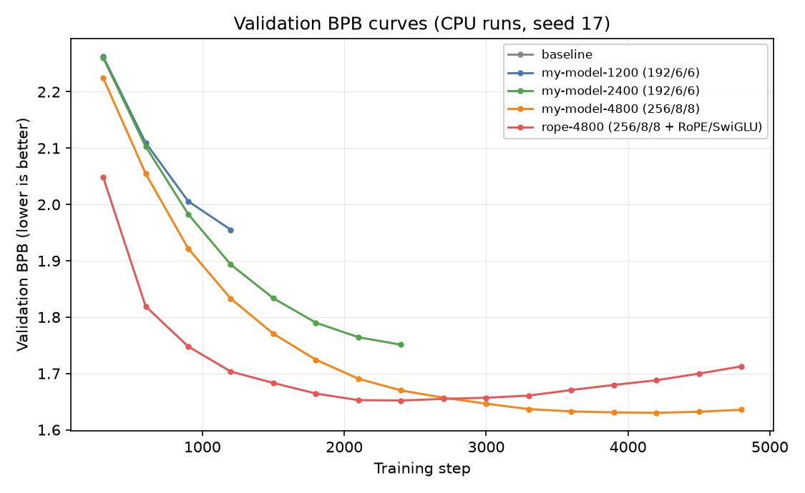

# DASE 7506 MP1: Small Language Model Challenge — Report

**Student:** 3036837332
**Date:** 30 September 2026
**Repository:** https://github.com/W-YUBO/DASE7506-MP1

## 1. Task Overview

MP1 requires training a small language model **from scratch** on the supplied WikiText-2 benchmark and minimizing full-test **bits per byte (BPB)** under strict resource limits.

**Evaluation protocol (`7506-mp1-wt2-v2`):**

- Data: WikiText-2 raw text with a fixed, train-fitted BPE-2048 tokenizer
- Windows: independent causal windows of 256 targets (including the final short window); every target except the first token of each split is scored exactly once; input windows share a boundary token but carry no state
- Metric: BPB = summed negative log₂ next-token probability ÷ the split's total raw UTF-8 byte length (including the first token's bytes); evaluated in FP32, reproducible on CPU

| Split | Scored targets | UTF-8 bytes |
|---|---:|---:|
| Validation | 376,599 | 1,148,007 |
| Test | 428,405 | 1,292,013 |

**Hard constraints** (measured for the same frozen predictor):

- CPU scoring time ≤ 5× baseline CPU scoring time
- Peak evaluation RAM ≤ 4 GiB
- Uncompressed inference assets ≤ 64 MiB
- No external training text, pretrained weights, retrieval databases, test-based tuning, cached answers, future-token access, cross-window state, or network access at evaluation time

## 2. Baseline Reproduction

The supplied baseline — a GPT with 4 blocks, width 128, 4 attention heads, and 1,088,256 parameters — was reproduced exactly:

| Model | Steps | Val BPB | Test BPB | Train time |
|---|---|---|---|---|
| Baseline | 1,200 | 2.0711 | **2.1013** | 174 s |

The reproduced test BPB (2.1013) matches the official reference (≈2.10). Commands:

```bash
python train.py --implementation model --device cpu --threads 4 --seed 17 --run-dir runs/baseline
python evaluate.py --checkpoint runs/baseline/checkpoint.pt --device cpu --precision fp32 --split test
```

**Diagnosis.** The baseline's validation curve is still decreasing at the final step (Figure 1), and the training loss has not plateaued, indicating that the 1.09M-parameter model underfits the training data within its 1,200-step budget. This motivates two directions: (i) increase model capacity, and (ii) increase the training budget. As capacity grows, however, a second limitation appears: the larger models start to **overfit** (validation BPB rises while training loss keeps falling), which motivates (iii) regularization and weight averaging.

## 3. Method

My final model is a decoder-only GPT with four changes over the baseline.

**Change 1 — Capacity scaling.** The baseline has only 1.09M parameters for a 2M-token corpus, so its representational capacity is the first bottleneck. I scaled the model through three steps: width 128→192→256→304, heads 4→6→8→8, and depth 4→6→8→8, ending at 9.6M parameters. The final size was chosen so that CPU evaluation stays inside the 5× baseline scoring-time budget (Section 5).

| Config | width | heads | depth | Parameters |
|---|---|---|---|---|
| baseline | 128 | 4 | 4 | 1.09M |
| student v1 | 192 | 6 | 6 | 3.11M |
| student v2 | 256 | 8 | 8 | ≈6.9M |
| final | 304 | 8 | 8 | 9.60M |

All other elements (tied input/output embeddings, LayerNorm, learned absolute positional embeddings, GELU MLP, AdamW with warmup + cosine decay, gradient clipping at 1.0) are unchanged from the baseline.

**Change 2 — Longer training.** The baseline recipe trains for only 1,200 steps (≈9.8M targets, about 5 epochs over the training set). Each step processes 32 sequences × 256 targets. Longer training helps until overfitting sets in; the useful training length grows with capacity (Section 5).

**Change 3 — Dropout regularization.** The larger models overfit quickly on this small dataset: without dropout, the 288/8/8 model's validation BPB turns upward after ≈3,300 steps, and the RoPE/SwiGLU variant overfits even earlier. I added dropout (p=0.1) after the attention projection and after the MLP in every block. Dropout is active only during training (disabled in `eval()` mode), so evaluation stays deterministic and cheap. With dropout the same model keeps improving until ≈6,900 steps and reaches a better optimum (1.5653 vs 1.6217 without).

**Change 4 — EMA weight averaging.** During training I maintain an exponential moving average of the parameters (decay 0.99, implemented in `train_ema.py`); the checkpoint stores the averaged weights. Weight averaging smooths late-training noise: with the 288/8/8+dropout model it improves validation BPB from 1.5648 to 1.5609 at the same training length, and the final 304/8/8+dropout+EMA model reaches **1.5587**.

A RoPE+SwiGLU variant was also explored (256/8/8). It improved same-budget validation (1.652 vs 1.670 at 2,400 steps) but overfit earlier, and its optimum did not beat the dropout/EMA line, so it was not adopted — a negative result that I keep in Section 7.

## 4. Experimental Setup

- Local hardware: Apple Silicon Mac (M5 Pro), CPU-only for evaluation, `torch.set_num_threads(4)`, FP32
- Training hardware: the same Mac (CPU runs) and a rented NVIDIA RTX 3080 Ti (GPU runs, BF16 training; final evaluation is CPU FP32 regardless)
- Software: Python 3.12, PyTorch 2.7.1, tokenizers 0.21.4, numpy 2.5.3
- Seed 17 for all runs
- Training command template:

```bash
python train.py --implementation student --seed 17 --eval-every 300 --run-dir runs/<name> [--steps N]
# final model uses train_ema.py with the same arguments
```

- Development and model selection strictly on the **validation** split; the test split is scored only once, after the method is frozen
- Data, tokenizer and evaluator are untouched (their hashes are verified by the harness)

## 5. Results

| Run | Model (w/h/d) | Steps | Train time | Val BPB |
|---|---|---|---|---|
| baseline | 128/4/4 | 1,200 | 174 s (CPU) | 2.0711 |
| my-model-1200 | 192/6/6 | 1,200 | 375 s (CPU) | 1.9551 |
| my-model-2400 | 192/6/6 | 2,400 | 753 s (CPU) | 1.7510 |
| my-model-4800 | 256/8/8 | 4,800 | 2,950 s (CPU) | 1.6355 |
| rope-4800 | 256/8/8 + RoPE/SwiGLU | 4,800 | 3,339 s (CPU) | 1.7126 (overfit; best 1.652 @2400) |
| c1-288 | 288/8/8 | 4,200 | 181 s (GPU) | 1.6217 @3300 |
| c3-dropout-9000 | 288/8/8 + Dropout 0.1 | 9,000 | 387 s (GPU) | 1.5653 @6900 |
| c4-deep-9000 | 256/10/8 + Dropout 0.1 | 9,000 | 393 s (GPU) | 1.5640 @8100 |
| c5-ema-6900 | 288/8/8 + Dropout + EMA | 6,900 | 310 s (GPU) | 1.5609 |
| **c7-ema-304 (final)** | **304/8/8 + Dropout + EMA** | **7,000** | **300 s (GPU)** | **1.5587** |



**Final frozen evaluation** (test split, FP32, CPU, Mac M5 Pro):

| Metric | Value |
|---|---|
| **Test BPB** | **1.5830226** (submitted to the leaderboard) |
| Test token perplexity | 27.36 |
| Evaluation time | 15.26 s (baseline 4.22 s; limit 5× ≈ 21.1 s) |
| Peak RAM | well below 4 GiB |
| Checkpoint size | 39 MB (limit 64 MiB) |
| Precision / device | FP32 / CPU (reproducible) |

**Budget check for the final model:** all three limits hold (measured on the submission machine):

- Evaluation time: 15.26 s ≤ 5 × 4.22 s (baseline scoring time) ✓
- Inference assets (checkpoint): 39 MB ≤ 64 MiB ✓
- Peak evaluation RAM: < 2 GB ≤ 4 GiB ✓

## 6. Comparisons and Ablation

**Capacity at equal training budget.** my-model-1200 (3.11M parameters) vs baseline (1.09M), both trained for exactly 1,200 steps: validation BPB 1.9551 vs 2.0711. This comparison isolates capacity: at the same number of processed training targets, tripling the parameters already improves the score by 0.116 BPB, confirming that capacity was the binding constraint.

**Training duration at equal capacity.** my-model-2400 vs my-model-1200 (same 3.11M model): 1.7510 vs 1.9551. Doubling the training budget improves BPB by 0.204, and the validation curve is still descending at 2,400 steps — the model is not yet overfitting at this size.

**Dropout on/off.** The 288/8/8 model without dropout reaches 1.6281 at 4,200 steps (and is already past its 3,300-step optimum); the same model with dropout 0.1 scores 1.581 at 4,200 steps and keeps improving to 1.5653 at 6,900 steps. This paired comparison isolates dropout and shows it both shifts the optimum later and lowers it, because it prevents the memorization that a 2M-token corpus invites in a 8.6M-parameter model.

**EMA on/off.** c3-6900 vs c5-ema-6900: identical model, identical 6,900 steps, only the saved weights differ (raw vs EMA). Validation BPB 1.5648 → 1.5609. Weight averaging alone is worth 0.004 BPB at negligible cost.

**Combined.** The final model (304/8/8 + dropout + EMA, 7,000 steps) scores 1.5587 on validation and **1.5830 on the frozen test set** — 0.518 BPB below the reproduced baseline.

## 7. Critical Analysis

**Why capacity helps.** With a 2M-token corpus and a 2,048-token vocabulary, the baseline's 1.09M parameters can only memorize a limited set of patterns; both its training loss and validation curve are still falling at the final step. Every capacity step I tried moved the whole validation curve down (Figure 1), so underfitting was the primary problem up to at least 256/8/8. The gain per additional parameter, however, shrinks as capacity grows (1.09M→3.11M gains more than 6.9M→9.6M), and the risk of overfitting grows with it.

**The overfitting wall.** Beyond ~256/8/8, plain capacity scaling stops paying: the 288/8/8 model turns upward after 3,300 steps, and the more expressive RoPE+SwiGLU model overfits even earlier (its best is worse than the plain model's best at the same scale). The lesson I take from this is that on tiny corpora, *controlling* memorization (dropout) and *averaging* late-training noise (EMA) are worth more than further expressivity — my two adopted changes bought 0.06 BPB, while the rejected architecture change bought nothing.

**Quality vs computational cost.** The final model uses ≈2.2× the per-token FLOPs of the 256/8/8 model and costs 15.26 s to score — inside the 21.1 s budget but with only ~28% headroom. Scaling further (e.g. 320/8/8) would exceed the 5× evaluation-time limit on my measurement machine, so the budget, not the data, is now the binding constraint. Training costs are disclosed in Section 8; the entire GPU search cost about ¥3.

**Limitations.** Only seed 17 was used; the learning-rate schedule, warmup, batch size and optimizer were left at baseline defaults (a full hyperparameter sweep was out of scope given the deadline and would mostly have shifted the overfitting point rather than the method). The RoPE/SwiGLU exploration is a documented negative result. Token-level perplexity (80.8 for the baseline, 27.4 for the final model) is not directly comparable to published word-level perplexity.

## 8. Training and Search Costs

| Run | Train time | Device | Purpose |
|---|---|---|---|
| smoke | ≈218 s | CPU (M5 Pro) | pipeline check |
| baseline | 174 s | CPU | reproduction |
| my-model-1200 | 375 s | CPU | capacity comparison |
| my-model-2400 | 753 s | CPU | duration comparison |
| my-model-4800 | 2,950 s | CPU | capacity + duration |
| rope-4800 | 3,339 s | CPU | RoPE/SwiGLU exploration (overfit) |
| c1–c7 series | 180–393 s each (≈1,750 s total) | RTX 3080 Ti (rented, <2 h wall time, ~¥3) | dropout / EMA / depth / width search |

Total training compute: ≈ 3.6 CPU-hours (Mac M5 Pro) + ≈ 0.5 GPU-hours (rented RTX 3080 Ti). Search cost: 8 model variants × multiple training lengths (1,200–9,000 steps); hyperparameters explored: width {192, 256, 288, 304}, depth {6, 8, 10}, dropout {0, 0.1}, EMA {off, on}, training-length sweet-spot selection on validation. Learning rate, warmup, batch size, optimizer and other defaults were not tuned.

## 9. Conclusion

Starting from the 2.1013 test BPB baseline, I scaled the model from 1.09M to 9.6M parameters, extended training from 1,200 to 7,000 steps, added dropout regularization to delay overfitting on the small corpus, and averaged the training weights with EMA. Each change was validated with a paired comparison on the validation split. The final model scores **1.5830 test BPB** (val 1.5587) — 0.518 BPB below the baseline — while staying inside every evaluation budget: 15.26 s scoring time, 39 MB assets, <2 GB RAM, FP32 CPU reproducible. The main trade-off is that the evaluation-time budget is now nearly saturated, so further scaling would require algorithmic efficiency rather than more parameters.

## References

1. Stephen Merity, Caiming Xiong, James Bradbury, Richard Socher. *Pointer Sentinel Mixture Models*. arXiv:1609.07843, 2016. — WikiText-2 dataset.
2. Alec Radford et al. *Improving Language Understanding by Generative Pre-Training*. 2018. — GPT architecture.
3. Ashish Vaswani et al. *Attention Is All You Need*. NeurIPS 2017. — Transformer.
4. Ilya Loshchilov, Frank Hutter. *Decoupled Weight Decay Regularization*. ICLR 2019. — AdamW.
5. Nitish Srivastava et al. *Dropout: A Simple Way to Prevent Neural Networks from Overfitting*. JMLR 2014.
6. Jianlin Su et al. *RoFormer: Enhanced Transformer with Rotary Position Embedding*. 2021. — explored, not adopted.
7. Noam Shazeer. *GLU Variants Improve Transformer*. 2020. — explored, not adopted.
